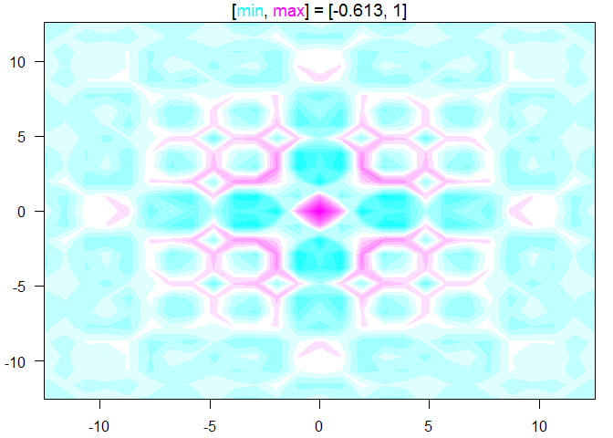
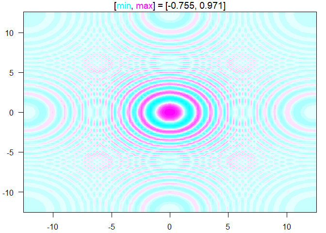
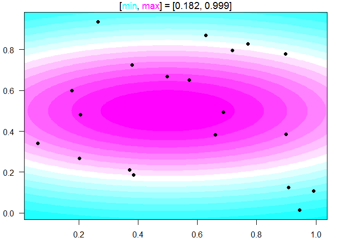
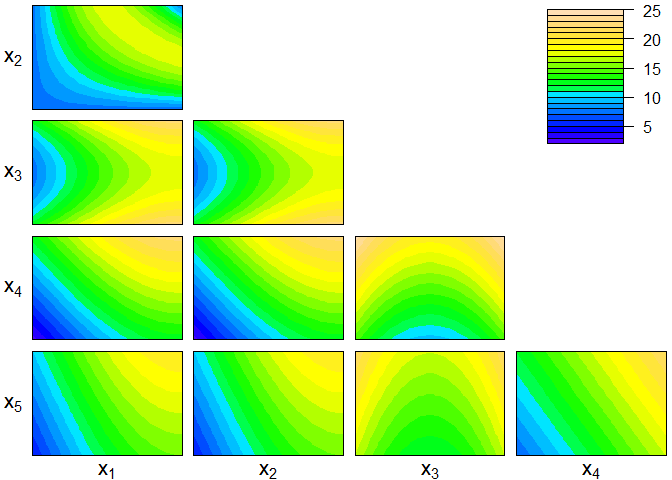
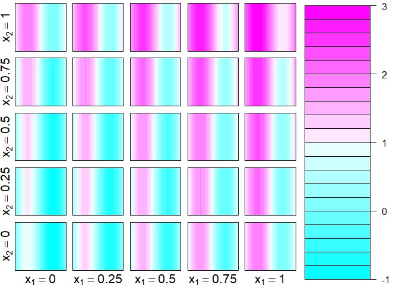

<!-- README.md is generated from README.Rmd. Please edit that file -->

# ContourFunctions

<!-- badges: start -->

[](https://travis-ci.org/CollinErickson/ContourFunctions)
[](https://cran.r-project.org/package=ContourFunctions)
[](https://codecov.io/gh/CollinErickson/ContourFunctions?branch=master)
[](https://github.com/CollinErickson/ContourFunctions/actions/workflows/R-CMD-check.yaml)
<!-- badges: end -->

This is an R package that provides simple functions for creating contour
plots.

## Overview

The main functions are:

- `cf_grid`: Makes a contour plot from grid data.

- `cf_func`: Makes a contour plot for a function.

- `cf_data`: Makes a contour plot for a data set by fitting a Gaussian
  process model.

- `cf`: Passes arguments to `cf_function` or `cf_data` depending on
  whether the first argument is a function or numeric.

All of these functions make the plot using base graphics by default. To
make plots using ggplot2, add the argument `gg=TRUE`, or put g in front
of the function name. E.g., `gcf_data(...)` is the same as
`cf_data(..., gg=TRUE)`, and makes a similar plot to `cf_data` but using
ggplot2.

There are two functions for making plots in higher dimensions:

- `cf_4dim`: Plots functions with four inputs by making a series of
  contour plots.

- `cf_highdim`: Plots for higher dimensional inputs by making a contour
  plot for each pair of input dimensions and holding the other inputs
  constant or averaging over them.

## Installation

    # It can be installed like any other package
    install.packages("ContourFunctions")

    # Or the the development version from GitHub:
    # install.packages("devtools")
    devtools::install_github("CollinErickson/contour")

## Usage

Plot a grid of data:

``` r
library(ContourFunctions)
a <- b <- seq(-4*pi, 4*pi, len = 27)
r <- sqrt(outer(a^2, b^2, "+"))
cf_grid(a, b, cos(r^2)*exp(-r/(2*pi)))
```

<!-- -->

Plot a function with two input dimensions:

``` r
f1 <- function(r) cos(r[1]^2 + r[2]^2)*exp(-sqrt(r[1]^2 + r[2]^2)/(2*pi))
cf_func(f1, xlim = c(-4*pi, 4*pi), ylim = c(-4*pi, 4*pi))
```

<!-- -->

Using data with two inputs and an output, fit a Gaussian process model
and show the contour surface with dots where the points are:

``` r
set.seed(0)
x <- runif(20)
y <- runif(20)
z <- exp(-(x-.5)^2-5*(y-.5)^2)
cf_data(x,y,z)
#> Fitting with laGP since n <= 200
```

<!-- -->

For more than two input dimensions:

``` r
friedman <- function(x) {
  10*sin(pi*x[1]*x[2]) + 20*(x[3]-.5)^2 + 10*x[4] + 5*x[5]
}
cf_highdim(friedman, 5, color.palette=topo.colors)
```

<!-- -->

For (three or) four inputs dimensions:

``` r
cf_4dim(function(x) {x[1] + x[2]^2 + sin(2*pi*x[3])})
```

<!-- -->
